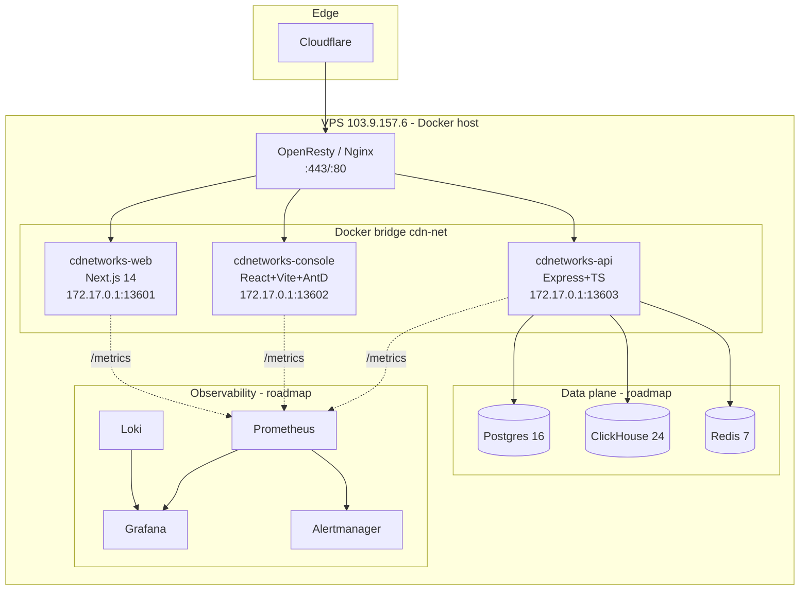
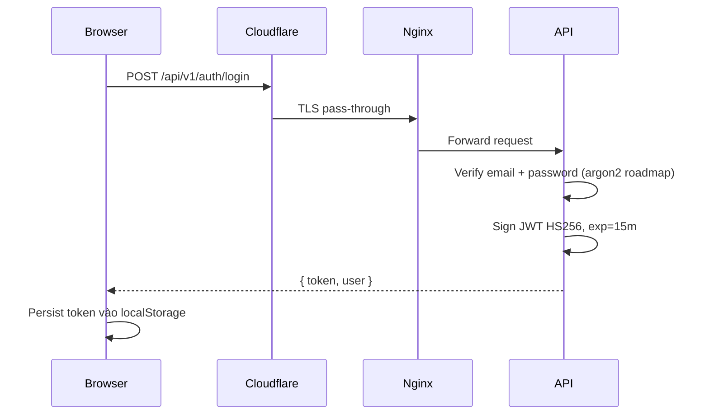
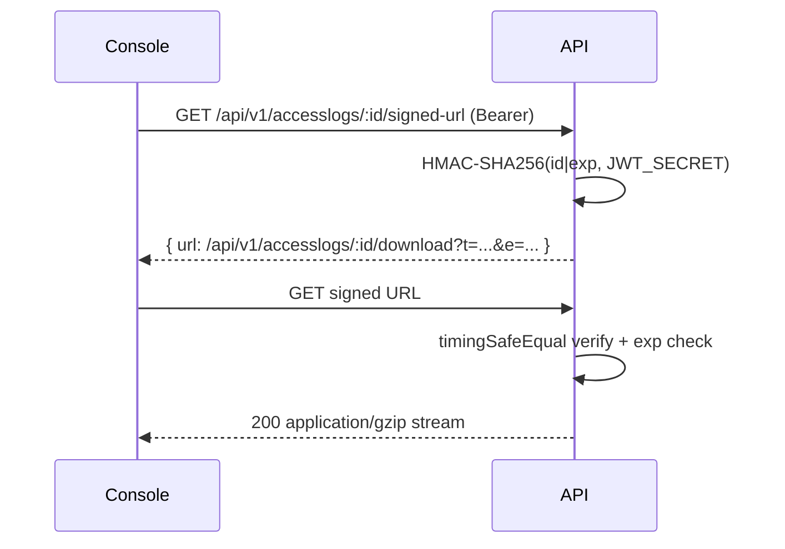
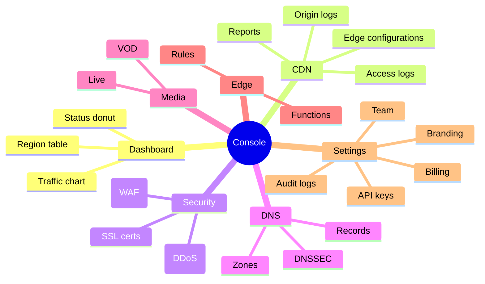

# Logical Architecture

## Container diagram

## Vai trò từng container

| Container | Image | Port nội bộ | Bind ngoài | Vai trò |
|---|---|---|---|---|
| cdnetworks-web | `cdn/web:latest` (multi-stage Next.js) | 3000 | 172.17.0.1:13601 | Marketing site + nhúng docs `/document/` |
| cdnetworks-console | `cdn/console:latest` (Vite SPA + nginx static) | 80 | 172.17.0.1:13602 | UI quản trị |
| cdnetworks-api | `cdn/api:latest` (Node 20 Alpine) | 4000 | 172.17.0.1:13603 | REST API + JWT + HMAC signed log |

## Luồng dữ liệu chính

### Login flow

### Access log signed download

## Module decomposition (Console)

