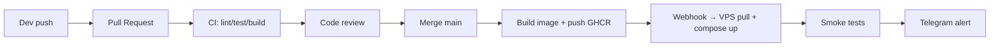

# Operations & CI/CD

## Branching model

- `main` — luôn deploy được, mọi commit qua PR + review.
- `feat/*`, `fix/*`, `chore/*` — branch ngắn, squash merge.
- `hotfix/*` — fast-track, vẫn cần PR.

## PR checklist

- [ ] Lint (`pnpm lint`)
- [ ] Typecheck (`pnpm typecheck`)
- [ ] Unit test (`pnpm test`)
- [ ] Build (`pnpm build`)
- [ ] Cập nhật docs nếu thay đổi public API
- [ ] Cập nhật `AI_CONTEXT.md` nếu thay đổi cấu trúc

## GitHub Actions (hiện tại + đề xuất)

| Workflow | Trigger | Mục đích | Trạng thái |
|---|---|---|---|
| `docs.yml` | push `main` | Build & deploy GH Pages | ✅ |
| `ci.yml` (P1.1) | PR + push | Lint/typecheck/test/build | ⏳ |
| `release.yml` | tag `v*` | Build image + push GHCR + changelog | ⏳ |
| `nightly.yml` | cron 03:00 UTC | `pnpm audit`, `docker scout`, smoke | ⏳ |

## Image tag convention

```
ghcr.io/<org>/cdn-api:<short-sha>
ghcr.io/<org>/cdn-api:v1.2.3
ghcr.io/<org>/cdn-api:latest      # = main HEAD
```

## Deployment pipeline (đề xuất)



## Webhook deploy script (đề xuất)

`scripts/deploy-webhook.sh` lắng nghe GitHub webhook (qua `webhook` listener) → pull image mới + `docker compose up -d`.

## Quy trình release

1. Đảm bảo `main` xanh.
2. `pnpm changeset` → mô tả thay đổi.
3. `pnpm changeset version` → bump version.
4. Tag `vX.Y.Z` + push.
5. Workflow `release.yml` build image + release notes.
6. Smoke production.
7. Cập nhật `CHANGELOG.md`.
