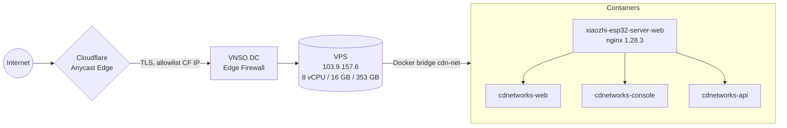
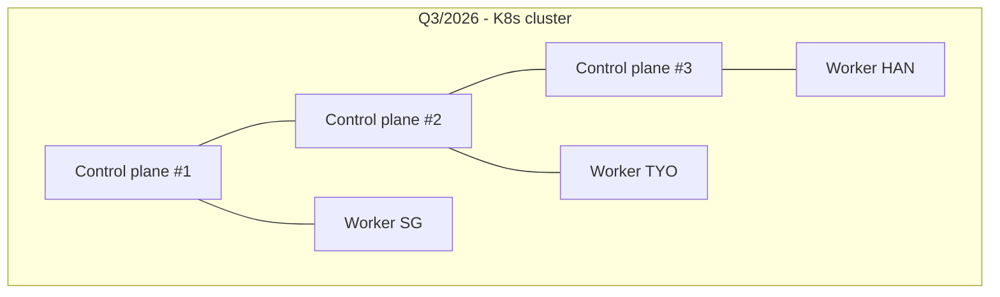

# Physical Topology

## Hạ tầng vật lý hiện tại

| Hạng mục | Thông số |
|---|---|
| Nhà cung cấp | VNSO / on-prem DC Hà Nội |
| Host | VPS đơn `vnso-cdn-prod-01` |
| Public IP | `103.9.157.6` (IPv4) — IPv6 chưa cấp |
| CPU | x86_64, ~8 vCPU (verify `nproc`) |
| RAM | ~16 GB (verify `free -h`) |
| Disk | 353 GB SSD — đang dùng 83% (61 GB free) |
| OS | Ubuntu 22.04 LTS |
| Kernel | 5.15+ |
| Docker | 24.x + Compose v2 |
| Reverse proxy | OpenResty/Nginx 1.28.3 (chạy trong container `xiaozhi-esp32-server-web`) |
| TLS | Wildcard `*.vnso.vn` (ZeroSSL/Let's Encrypt, exp 2026-10-22) |
| Front edge | Cloudflare (Free/Pro), proxy ON cho mọi record |

## Sơ đồ vật lý



## Bố trí port trên host

| Bind | Container | Mục đích |
|---|---|---|
| 0.0.0.0:80 | nginx | HTTP redirect → 443 |
| 0.0.0.0:443 | nginx | TLS termination, vhost routing |
| 127.0.0.1:13601 → 3000 | cdnetworks-web | Next.js |
| 127.0.0.1:13602 → 80 | cdnetworks-console | Vite SPA |
| 127.0.0.1:13603 → 4000 | cdnetworks-api | Express |
| 127.0.0.1:5432 (roadmap) | postgres | DB |
| 127.0.0.1:8123 (roadmap) | clickhouse | OLAP |
| 127.0.0.1:6379 (roadmap) | redis | Cache/queue |

Chỉ port 80/443 mở ra Internet; mọi port khác bind loopback hoặc Docker bridge nội bộ.

## Docker bridges

```
cdn-net           172.20.0.0/16   cdnetworks-{web,console,api,postgres,redis,clickhouse}
xiaozhi-net       172.21.0.0/16   xiaozhi-esp32-server-web (nginx) + cross-attach
```

`cdnetworks-*` cũng attach vào `xiaozhi-net` để nginx tiếp cận trực tiếp qua hostname container.

## Nguồn điện / mạng

- DC dual feed AC, UPS N+1.
- 2 đường upstream BGP (FPT + Viettel).
- Cloudflare đứng trước → tận dụng Anycast 300+ POP, hấp thụ DDoS L3/L4/L7.

## Roadmap mở rộng



- 3 control plane HA (etcd quorum).
- Worker tại Singapore, Tokyo, Hà Nội để chạy POP edge thật.
- GeoDNS qua Cloudflare Load Balancer.
