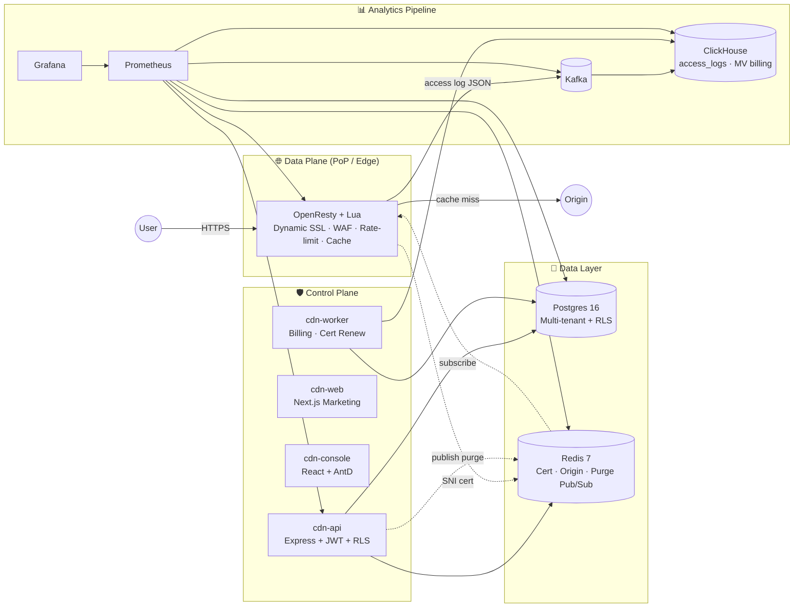

# Triển khai hạ tầng đầy đủ — Full Enterprise Stack

> Bản này mô tả kiến trúc **3-tier Production-Grade** của CDNetworks Platform,
> giống mô hình Cloudflare/Akamai. Toàn bộ blueprint nằm trong repo, sẵn sàng
> `docker compose up` khi chuyển sang môi trường multi-node.

## 1. Sơ đồ kiến trúc



## 2. URL & Endpoint

| Thành phần | URL công khai | Container | Port nội bộ |
|---|---|---|---|
| Landing + Docs | https://cdnetworks.vnso.vn | `cdn-web` | 3000 |
| Documentation | https://cdnetworks.vnso.vn/document | _(embedded)_ | — |
| Console quản trị | https://console-cdnetworks.vnso.vn | `cdn-console` | 80 |
| API | https://console-cdnetworks.vnso.vn/api/* | `cdn-api` | 4000 |
| Edge HTTP/S | `:80`, `:443` | `cdn-edge` (OpenResty) | 80/443 |
| Postgres | _internal_ | `cdn-postgres` | 5432 |
| Redis | _internal_ | `cdn-redis` | 6379 |
| ClickHouse | _internal_ | `cdn-clickhouse` | 8123 |
| Kafka | _internal_ | `cdn-kafka` | 9092 |
| Grafana | _internal/VPN_ | `cdn-grafana` | 3000 |
| Prometheus | _internal/VPN_ | `cdn-prometheus` | 9090 |

## 3. Cấu trúc thư mục blueprint

```
CDNetworks-platform/
├─ docker-compose.deploy.yml      # MVP: web + console + api (đang chạy)
├─ docker-compose.full.yml        # 🚀 Full enterprise (blueprint)
└─ infrastructure/
   ├─ sql/
   │  ├─ init-postgres.sql        # tenants, users, hostnames, ssl, RLS
   │  └─ init-clickhouse.sql      # access_logs + Materialized Views
   ├─ openresty/
   │  ├─ nginx.conf               # Edge config (SSL, cache, WAF)
   │  └─ lua/
   │     ├─ dynamic_ssl.lua       # SNI → Redis cert
   │     ├─ waf.lua               # SQLi/XSS/Traversal/Bad-bot
   │     ├─ rate_limit.lua        # Distributed RL qua Redis
   │     ├─ origin_lookup.lua     # Host → origin URL
   │     └─ purge_worker.lua      # Redis Pub/Sub purge
   └─ observability/
      └─ prometheus.yml
```

## 4. Bật full stack — 3 lệnh

```bash
# 1. Cấu hình secret
cd /root/CDNetworks-platform
cp .env.example .env
$EDITOR .env   # điền POSTGRES_PASSWORD, REDIS_PASSWORD, CLICKHOUSE_PASSWORD, GRAFANA_PASSWORD

# 2. Bật toàn bộ
docker compose -f docker-compose.full.yml --env-file .env up -d

# 3. Khởi tạo Kafka topic + ClickHouse MV
docker exec -it cdn-kafka kafka-topics.sh --bootstrap-server localhost:9092 \
  --create --topic cdn.access_logs --partitions 6 --replication-factor 1
docker exec -it cdn-clickhouse clickhouse-client \
  --query "SHOW TABLES FROM cdn_logs"
```

## 5. Tính năng dữ liệu / Edge

### 5.1 Dynamic SSL (giống Cloudflare Keyless / SNI Cert Lookup)

API ghi cert vào Redis:
```
SET ssl:cert:example.com "<PEM>"
SET ssl:key:example.com  "<PEM>"
```
Edge `dynamic_ssl.lua` đọc theo SNI, cache trong shared dict 5 phút → mỗi PoP
phục vụ **hàng triệu domain** mà không reload nginx.

### 5.2 Distributed Rate Limit

`rate_limit.lua` dùng `INCR` + `EXPIRE` trên Redis cluster. Mỗi cặp `(host, ip)`
giới hạn `RATE_LIMIT_PER_MIN` (mặc định 1000). Fail-open nếu Redis chết để
không chặn user thật.

### 5.3 Cache Purge real-time

```bash
# API publish:
redis-cli PUBLISH cdn.purge '{"host":"example.com","uri":"/static/app.js"}'
```
Tất cả Edge worker `purge_worker.lua` subscribe channel `cdn.purge` →
xóa file cache nginx ngay lập tức ở mọi PoP.

### 5.4 Phân tích log (ClickHouse + MV)

- Edge ghi log JSON → Vector/FluentBit → Kafka topic `cdn.access_logs`.
- ClickHouse `Kafka engine` ingest → Materialized View `access_logs_mv` → bảng
  `access_logs` (TTL 14 ngày).
- MV `bandwidth_hourly` & `bandwidth_daily` aggregate theo
  `(tenant_id, host, hour|day)` cho **billing** & dashboard.

```sql
-- Bandwidth tháng cho 1 tenant
SELECT host, sum(total_bytes)/1024/1024/1024 AS gb_used
FROM bandwidth_daily
WHERE tenant_id='t_abc' AND day >= toStartOfMonth(today())
GROUP BY host ORDER BY gb_used DESC;
```

## 6. Bảo mật / Multi-tenant

- **Postgres RLS**: mỗi query `SET LOCAL app.tenant_id` từ JWT → policy chặn cross-tenant.
- **JWT**: `JWT_SECRET` 32-byte, refresh-token rotation.
- **WAF**: SQLi / XSS / Path traversal / Bad-bot UA.
- **Audit log**: bảng `audit_logs` ghi mọi mutation kèm `actor_id`, `ip`, `changes` JSONB.
- **Secret**: production khuyến nghị HashiCorp Vault thay vì `.env`.

## 7. Quan sát (Observability)

- Prometheus scrape: API, Worker, OpenResty (nginx-prometheus-exporter), Postgres, Redis, ClickHouse, Kafka.
- Grafana dashboards: latency p50/p95/p99, cache HIT %, bandwidth, error rate.
- Alertmanager (kích hoạt sau): cảnh báo qua Slack/Telegram khi 5xx > 1% hoặc edge down.

## 8. HA / Scale (roadmap)

| Layer | Single-node hôm nay | Multi-region production |
|---|---|---|
| API | 1 container | K8s Deployment HPA 3+ replicas, multi-AZ |
| Edge | 1 OpenResty | Anycast IP + GeoDNS, mỗi PoP chạy DaemonSet |
| Postgres | 1 instance | Patroni / Citus, primary + replica |
| Redis | 1 instance | Redis Sentinel hoặc Cluster |
| ClickHouse | 1 node | Cluster 3+ node, Replicated*MergeTree |
| Kafka | 1 broker KRaft | 3+ broker, RF=3 |

Khi sẵn sàng chuyển K8s: dùng Helm chart trong `infrastructure/helm/` (sẽ thêm), GitOps qua ArgoCD, IaC qua Terraform (`infrastructure/terraform/`).

## 9. Liên kết nhanh

- 🔧 Repo: https://github.com/trinhtanphat/CDNetworks-platform
- 🖥 Console: https://console-cdnetworks.vnso.vn
- 🌐 Landing: https://cdnetworks.vnso.vn
- 📚 Docs: https://cdnetworks.vnso.vn/document
